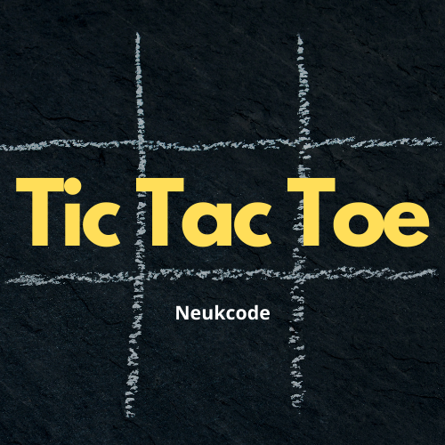
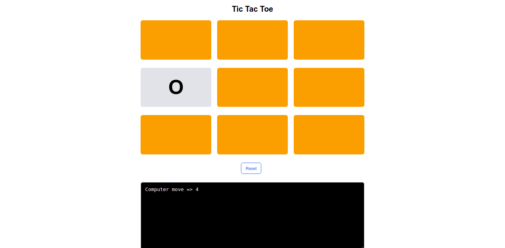
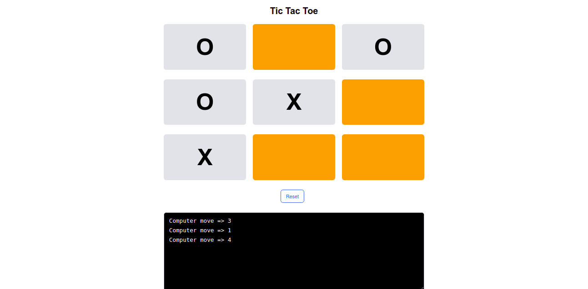
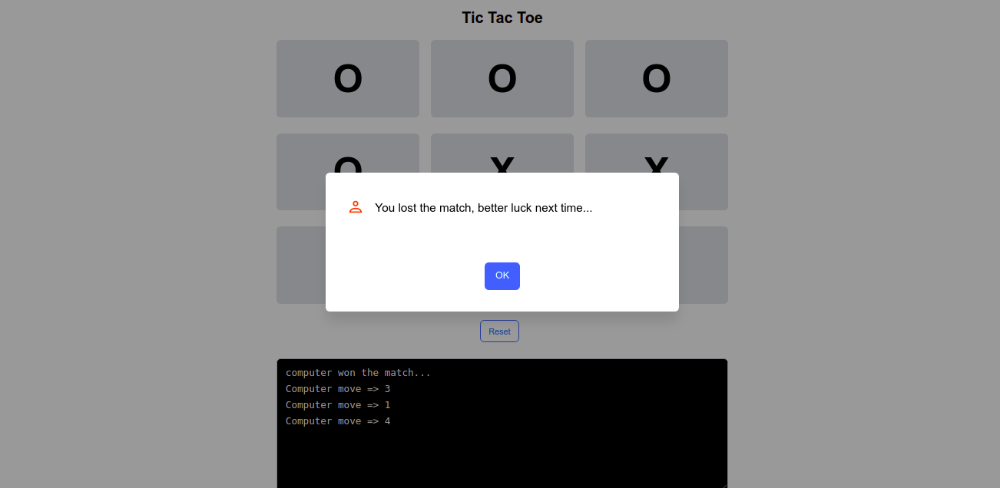

<p align="center">
 
</p>

<h3 align="center">Tic Tac Toe</h3>

<div align="center">

[](https://github.com/neukcode/tic-tac-toe-react/blob/master/LICENSE.md) [](https://github.com/neukcode/tic-tac-toe-react) [](https://github.com/neukcode/tic-tac-toe-react) [](https://github.com/neukcode/tic-tac-toe-react)

[](https://github.com/neukcode/tic-tac-toe-react/stargazers) [](https://github.com/neukcode/tic-tac-toe-react/network/members) [](https://github.com/neukcode/tic-tac-toe-react/watchers)

[](https://github.com/neukcode/tic-tac-toe-react/issues) [](https://github.com/neukcode/tic-tac-toe-react/issues?q=is%3Aissue+is%3Aclosed) [](https://github.com/neukcode/tic-tac-toe-react/pulls) [](https://github.com/neukcode/tic-tac-toe-react/pulls?q=is%3Apr+is%3Aclosed)

[](https://github.com/neukcode/tic-tac-toe-react) [](https://github.com/neukcode/tic-tac-toe-react)

[](https://github.com/neukcode/tic-tac-toe-react/graphs/contributors) [](https://github.com/neukcode/tic-tac-toe-react/graphs/commit-activity) [](https://github.com/neukcode/tic-tac-toe-react/discussions) [](https://twitter.com/neukcode?ref_src=twsrc%5Etfw) [](https://twitter.com/intent/tweet?screen_name=neukcode&ref_src=twsrc%5Etfw)


</div>

---

<p align="center"> A simple Tic Tac Toe Game in React (frontend)
    <br> 
</p>

## 📝 Table of Contents

- [About](#about)
- [Getting Started](#getting_started)
- [Built Using](#built_using)
- [Authors](#authors)

## 🧐 About <a name = "about"></a>

A simple Tic Tac Toe Game in React (frontend)

<p align="center">
 
</p>

<p align="center">
 
</p>

<p align="center">
 
</p>

## 🏁 Getting Started <a name = "getting_started"></a>

- clone project
  ```
  git clone https://github.com/neukcode/tic-tac-toe-react
  ```
  ```
  cd tic-tac-toe-react/
  ```
- Install packages
  ```
  yarn
  ```
- Start development server
  ```
  yarn start
  ```

## ⛏️ Built Using <a name = "built_using"></a>

- [React](https://reactjs.org/)
- [Atomize React](https://atomizecode.com/)

## ✍️ Authors <a name = "authors"></a>

- [@harshraj8843](https://github.com/harshraj8843)

